# Greatest of all time!

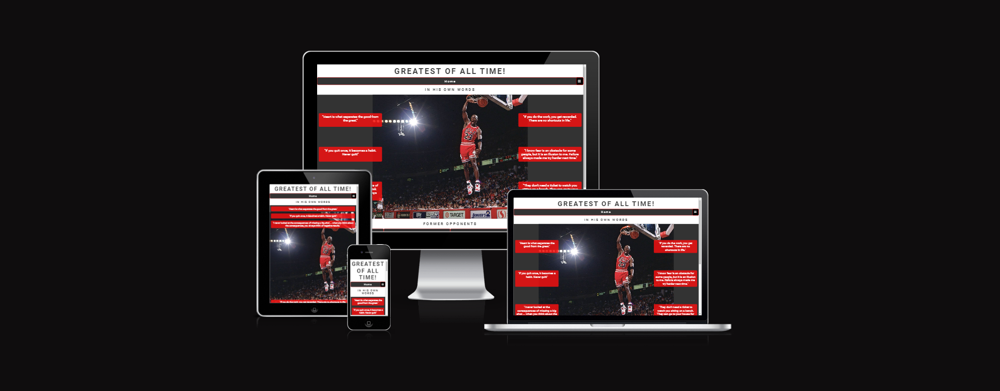

## Contents

- [Project Goals](#project-goals)

- [Design](#design)

- [Features](#features)

- [Testing](#testing)

* [Deployment](#deployment)

- [Credits](#credits)

## Project Goals

The greatest of all time website trying to show that Michael Jordan was the greatest basketball player of all time.

User of this website will be able to find plenty of information to support why he was this greatets of all time, including inspirtional quotes from the man himself showing his mentality, quotes from other former NBA players, stats, gallery and a voting form to decide yourself who you think is the greatest of all time.

## Design

### Wireframes

Wireframes were created to show basic structure of the page to build the website.

#### Home Page

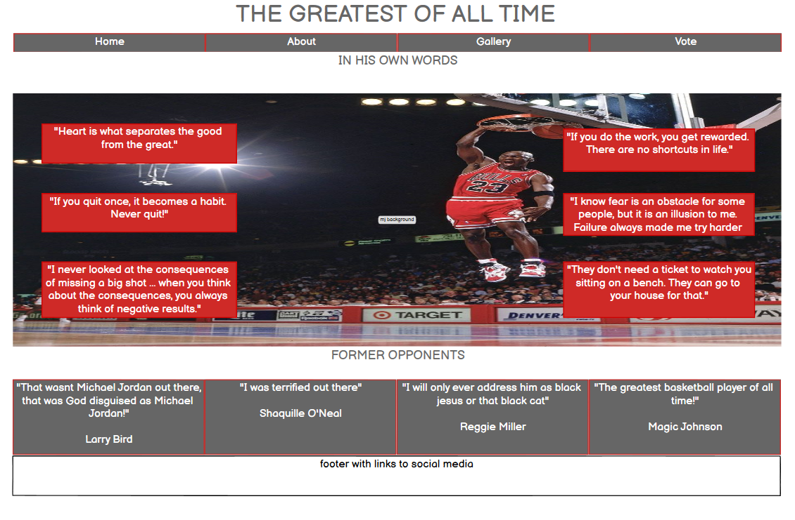

#### About Page

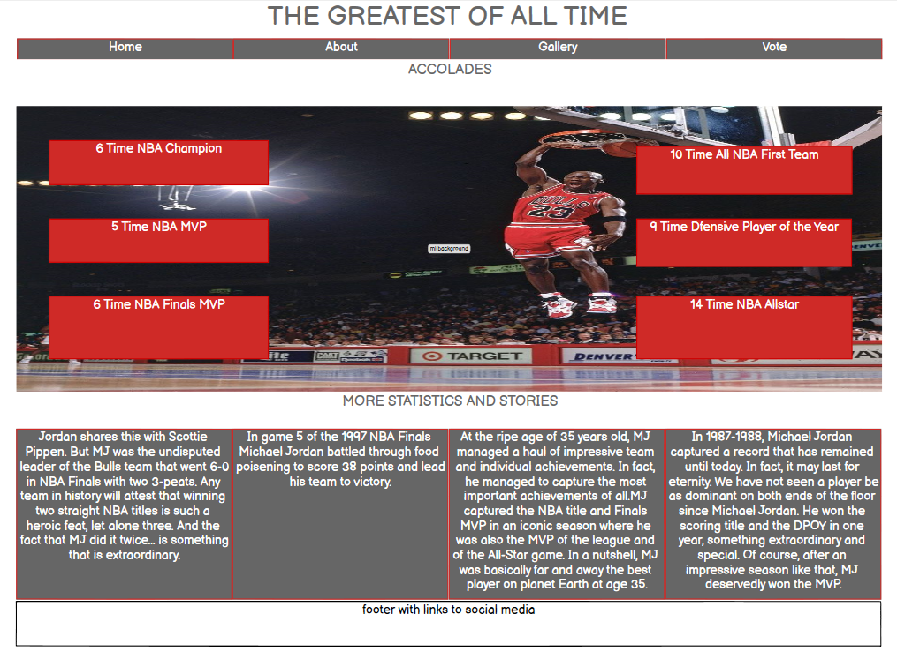

#### Gallery Page

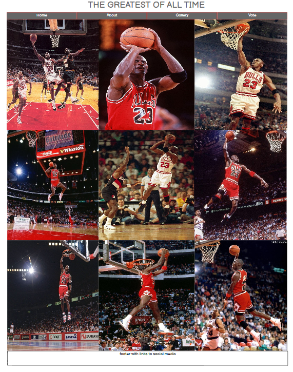

#### Vote Page

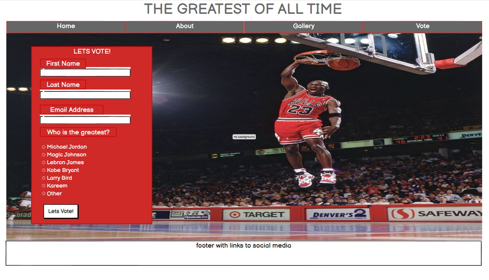

### Typography

Google Fonts was used to import the chosen fonts for use in the site
I have used Roboto font on this site. I have chosen this font because i believe it helps make the text clear and brings style to the site.

## Features

The website comprised of 4 pages which are extended from a base template.

- Home Page
- About Page
- Gallery Page
- Vote Page

#### Header

- Features at the top of every page and shows the site heading and contains the navigation links.
- The the navigation links are placed under the heading and spaced out equally across the page clear to see.
- The heading and navigation uses font colors that match the colors worn by Michael Jordan when playing for Chicago Bulls.

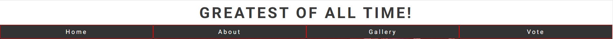

#### Footer

- A footer is displayed on all pages containing links to social

#### Home Page

- This contains a background image of Michael Jordan performing a slam dunk.
- Features quotes that Michael Jordan himself has said.
- Sub section where former NBA players are telling past experiences or views of Michael Jordan.
- The colors used across the page are to match the colors worn my Michael Jordan when playing for the Chicago Bulls.

Home page screenshot 1:
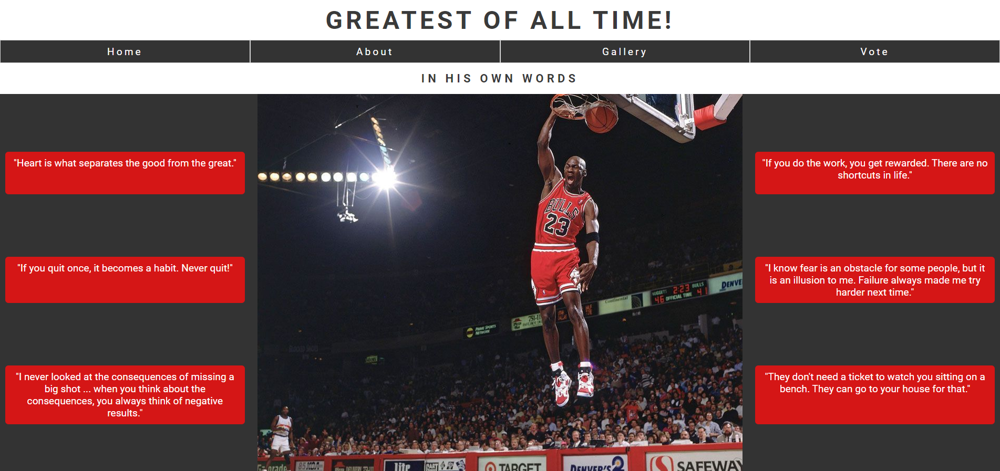

Home page screenshot 2:
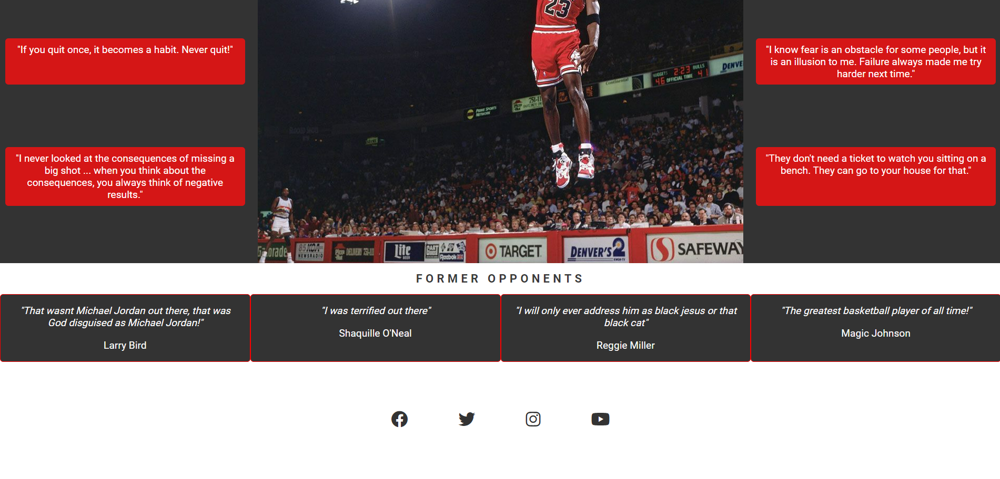

#### About Page

- This contains a background image of Michael Jordan performing a slam dunk.
- Features Stats about Michael Jordan.
- Sub section showing more stats and accomplishments by Michael Jordan.
- The colors used across the page are to match the colors worn my Michael Jordan when playing for the Chicago Bulls.

About page screenshot 1:
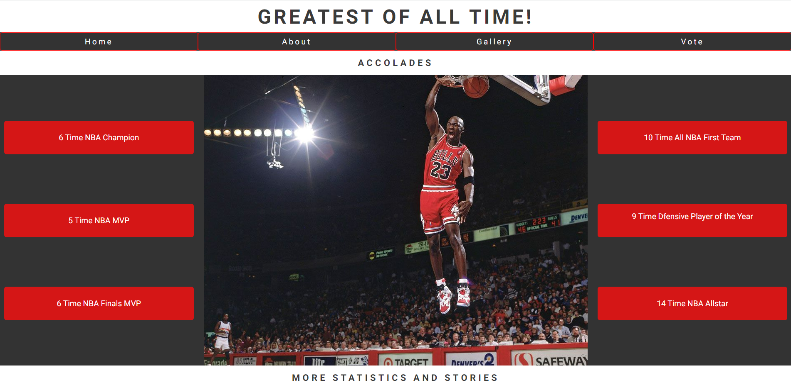

About page screenshot 2:
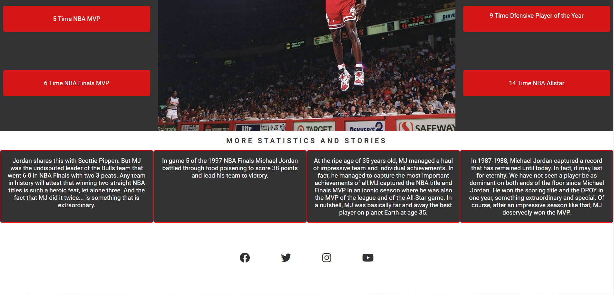

#### Gallery Page

- Contains images of Michael Jordan showing off his superior skills.

Gallery screenshot 1:
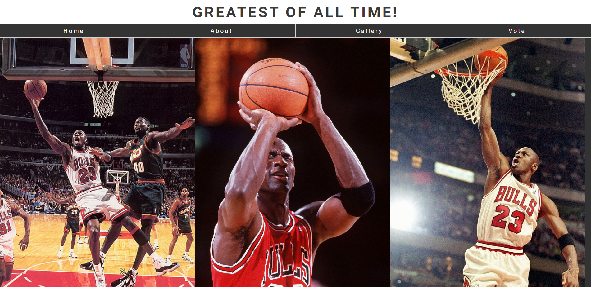

Gallery screenshot 2:
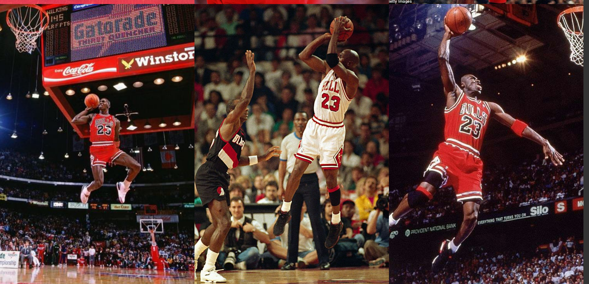

Gallery screenshot 3:
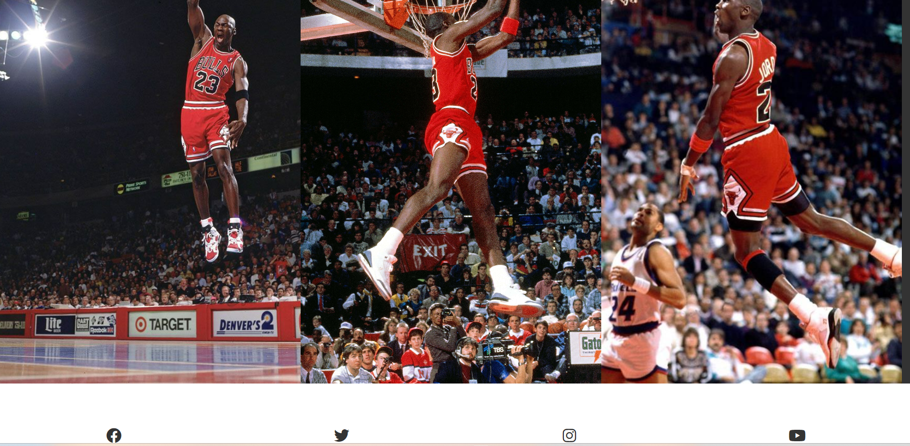

#### Vote Page

- This contains a background image of Michael Jordan performing a slam dunk.
- Features a form to which you can fill in your personal details and vote for who you think is the greatest of all time.

Vote page screenshot:
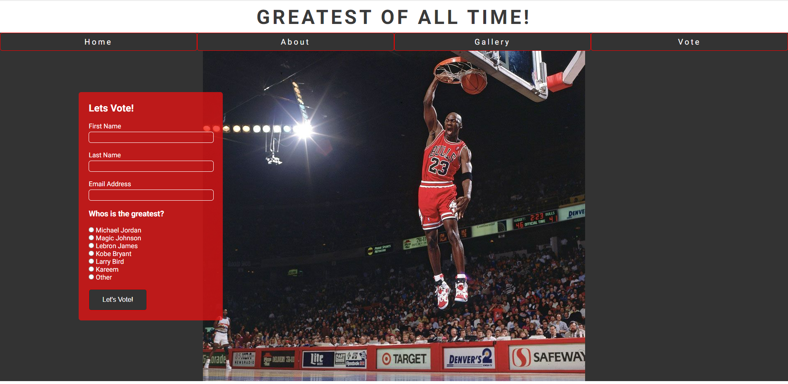

## Testing

- I have tested that the page works in different browsers: Chrome, Firefox
- I have confirmed that this project is responsive, looks good and functions on all standard screen sizes using the devtools device toolbar.
- I have confirmed that the header, navigation, footer, main sections and vote form text are all readable and easy to understand.
- I have confirmed that the form works: requires entries in every field, will only accept an email in the email field and the submit button works.
- I have confirmed that all navigation links work correctly.
- I have confirmed that all social media links in the footer work correctly: sending me to the correct site and opening in a new tab.

#### Validator Testing

- HTML
  - No errors were returned when passing through the official W3C validator.
- CSS
  - No errors were returned when passing through the oiffical (jigsaw) validator.
- Accessibility
  - I confirmed that the colors and fonts chosen are easy to read and accessible by running it through lighthouse in devtools.

Screenshot proving accessibility:
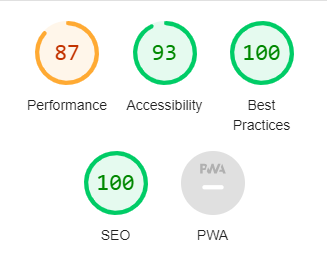

## Deployment

- The site was deployed to GitHub pages. The steps to deploy are as follows:
  - In the GitHub repository, navigate to the settings tab.
  - Click on the Pages link, in the list on the left hand side of the page.
  * GitHub Pages should now be showing, scroll down to branch and in the drop down box select branch main. Then click save.
  * Refresh the page and at the top the link to the site will be provided.

## Credits

#### Content

- The code to make the social media links was taken from the the CI Love Running project.
- The post address for the vote form was taken from the CI Love Running project.

#### Media

- All images for this project were taken from google images.
