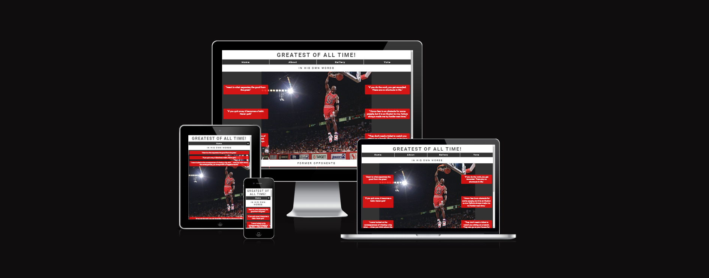
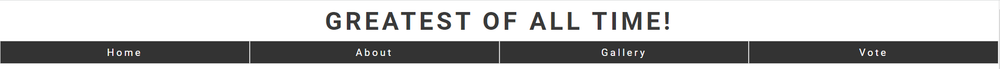
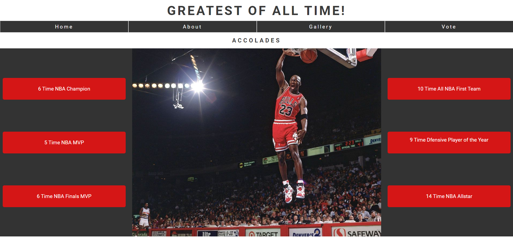
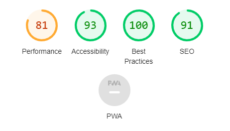

# Greatest of all time!

Greatest of all time was created as my first milestone project for the Code Institute Level 5 Diploma in Web Application Development.

Link to deployed site: https://sam2829.github.io/Project1-Michael-Jordan/

## Contents

- [Project Goals](#project-goals)

- [Design](#design)

- [Features](#features)

- [Testing](#testing)

* [Deployment](#deployment)

- [Credits](#credits)

## Project Goals

The greatest of all time website trying to show that Michael Jordan was the greatest basketball player of all time.

User of this website will be able to find plenty of information to support why he was this greatest of all time, including inspirational quotes from the man himself showing his mentality, quotes from other former NBA players, stats, gallery and a voting form to decide yourself who you think is the greatest of all time.

## Design

### Wireframes

Wireframes were created to show basic structure of the page to build the website.

#### Home Page

#### About Page

#### Gallery Page

#### Vote Page

### Typography

Google Fonts was used to import the chosen fonts for use in the site
I have used Roboto font on this site. I have chosen this font because I believe it helps make the text clear and brings style to the site.

## Features

The website comprised of 4 pages which are extended from a base template.

- Home Page
- About Page
- Gallery Page
- Vote Page

#### Header

- Features at the top of every page and shows the site heading and contains the navigation links.
- The navigation links are placed under a dropdown menu which is accessible by clicking on the menu icon on the right hand side of the page.
- The heading and navigation use font colors that match the colors worn by Michael Jordan when playing for Chicago Bulls.

#### Footer

- A footer is displayed on all pages containing links to social

#### Home Page

- This contains a background image of Michael Jordan performing a slam dunk.
- Features quotes that Michael Jordan himself has said.
- Sub section where former NBA players are telling past experiences or views of Michael Jordan.
- The colors used across the page are to match the colors worn my Michael Jordan when playing for the Chicago Bulls.

Home page screenshot 1:

Home page screenshot 2:

#### About Page

- This contains a background image of Michael Jordan performing a slam dunk.
- Features Stats about Michael Jordan.
- Sub section showing more stats and accomplishments by Michael Jordan.
- The colors used across the page are to match the colors worn my Michael Jordan when playing for the Chicago Bulls.

About page screenshot 1:

About page screenshot 2:

#### Gallery Page

- Contains images of Michael Jordan showing off his superior skills.

Gallery screenshot 1:

Gallery screenshot 2:

Gallery screenshot 3:

#### Vote Page

- This contains a background image of Michael Jordan performing a slam dunk.
- Features a form to which you can fill in your personal details and vote for who you think is the greatest of all time.

Vote page screenshot:

Vote page screenshot 2:

## Testing

- I have tested that the page works in different browsers: Chrome, Firefox, Microsoft Edge.
- I have confirmed that this project is responsive, looks good and functions on all standard screen sizes using the devtools device toolbar.
- I have confirmed that the header, navigation, footer, main sections and vote form text are all readable and easy to understand.
- I have confirmed that the form works: requires entries in every field, will only accept an email in the email field and the submit button works.
- I have confirmed that all navigation links work correctly.
- I have confirmed that all social media links in the footer work correctly: sending me to the correct site and opening in a new tab.

#### Validator Testing

W3C was used to validate the HTML on all pages of the website. It was also used to validate the CSS. I have checked the HTML via direct input.

- HTML W3C Validator
  - Index Page - No errors or warnings found.
  - About Page - No errors or warnings found.
  - Gallery page - No errors or warnings found.
  - Vote Page - No errors or warnings found.
- CSS
  - No errors or warnings were found.
- Accessibility
  - I used Lighthouse within the Chrome Developer Tools to test for accessibility for each page.

#### Desktop

Index page:

About Page:

Gallery Page:

Vote Page:

#### Mobile

Index page:

About Page:

Gallery Page:

Vote Page:

### Full Testing

Full testing was carried out on the following devices:

- Acer Aspire 3 Laptop
- Samsung Mobile

Additional testing was taken by friends and family on a variety of different screen sizes and devices.

| Feature            | Expected Outcome                                                                                                            | Testing Performed                                                                | Result                                                                                                                                                     | Pass / Fail |
| ------------------ | --------------------------------------------------------------------------------------------------------------------------- | -------------------------------------------------------------------------------- | ---------------------------------------------------------------------------------------------------------------------------------------------------------- | ----------- |
| `Navbar`           |
|                    |                                                                                                                             |                                                                                  |                                                                                                                                                            |             |
| Dropdown Menu Icon | When clicked the dropdown menu should open, provided links to navigate between pages.                                       | Clicked Dropdown menu icon                                                       | Navigation menu appears                                                                                                                                    | Pass        |
| Home Page Link     | When clicked the user will be redirected to the home page.                                                                  | Clicked link                                                                     | Redirected to home page.                                                                                                                                   | Pass        |
| About Page Link    | When clicked the user will be redirected to the about page.                                                                 | Clicked link                                                                     | Redirected to about page.                                                                                                                                  | Pass        |
| Gallery Page Link  | When clicked the user will be redirected to the gallery page.                                                               | Clicked link                                                                     | Redirected to gallery page.                                                                                                                                | Pass        |
| Vote Page Link     | When clicked the user will be redirected to the vote page.                                                                  | Clicked link                                                                     | Redirected to vote page.                                                                                                                                   | Pass        |
| `Footer`           |
|                    |                                                                                                                             |                                                                                  |                                                                                                                                                            |             |
| Facebook Icon      | When clicked the user will be taken to Facebook website in a new tab.                                                       | Clicked icon                                                                     | Facebook opened in new tab.                                                                                                                                | Pass        |
| Twitter Icon       | When clicked the user will be taken to Twitter website in a new tab.                                                        | Clicked icon                                                                     | Twitter opened in new tab.                                                                                                                                 | Pass        |
| Instagram Icon     | When clicked the user will be taken to Instagram website in a new tab.                                                      | Clicked icon                                                                     | Instagram opened in new tab                                                                                                                                | Pass        |
| YouTube Icon       | When clicked the user will be taken to YouTube website in a new tab.                                                        | Clicked icon                                                                     | YouTube opened in new tab                                                                                                                                  | Pass        |
| `Vote Page`        |
|                    |                                                                                                                             |                                                                                  |                                                                                                                                                            |             |
| First Name Input   | This is a required field so form should not submit if empty.                                                                | Tried to submit form with no value entered.                                      | Tooltip lets the user know this is a required field.                                                                                                       | Pass        |
| Last Name Input    | This is a required field so form should not submit if empty.                                                                | Tried to submit with no value entered.                                           | Tooltip lets the user know this is a required field.                                                                                                       | Pass        |
| Email Input        | This is a required field so form should not submit without email address entered.                                           | Tried to submit with no value entered and then with just text not email address. | With field empty tooltip lets the user know this is a required field. With just text the tooltip lets the user know they need to type in an email address. | Pass        |
| Radio Button Input | This is a required field so form should not submit without selecting an option.                                             | Tried to submit without selecting an option.                                     | Tooltip lets the user know this is a required field.                                                                                                       | Pass        |
| Let's Vote Button  | When form has been submitted the page from code institute saying congratulations the form has been correctly should appear. | Clicked let's vote button                                                        | Code institute congratulations page appears.                                                                                                               | Pass        |

## Deployment

- The site was deployed to GitHub pages. The steps to deploy are as follows:
  - In the GitHub repository, navigate to the settings tab.
  - Click on the Pages link, in the list on the left-hand side of the page.
  * GitHub Pages should now be showing, scroll down to branch and in the drop-down box select branch main. Then click save.
  * Refresh the page and at the top the link to the site will be provided.

## Credits

#### Content

- The code to make the social media links was taken from the CI Love Running project.
- The post address for the vote form was taken from the CI Love Running project.
- Quotes and statistics were taken from Google and Netflix.

#### Media

- All images for this project were taken from google images.
